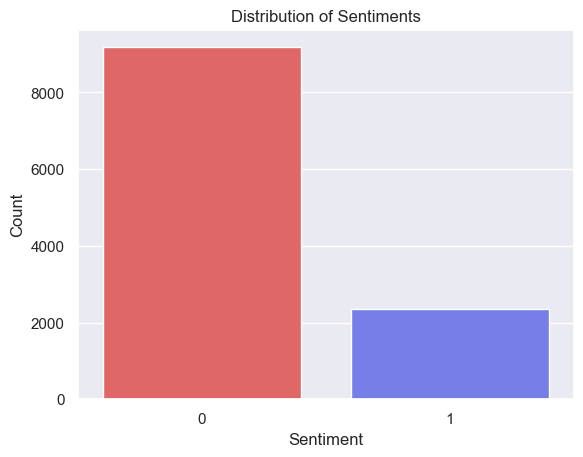
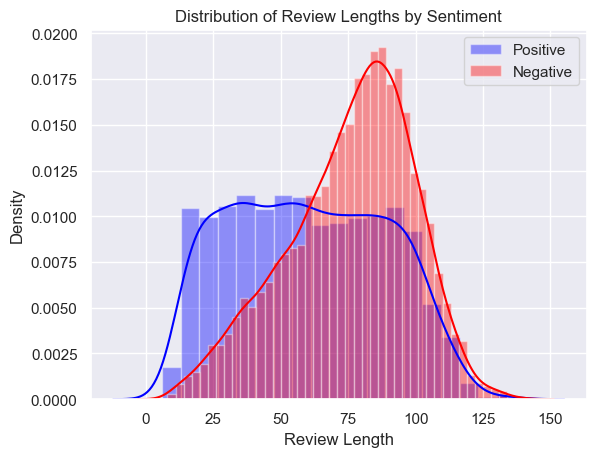
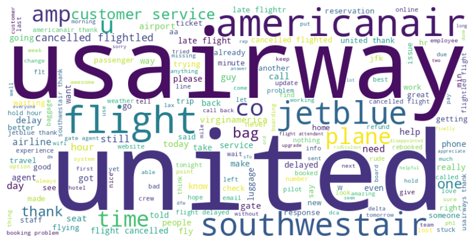
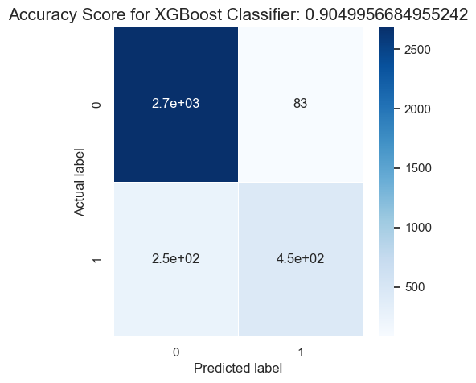
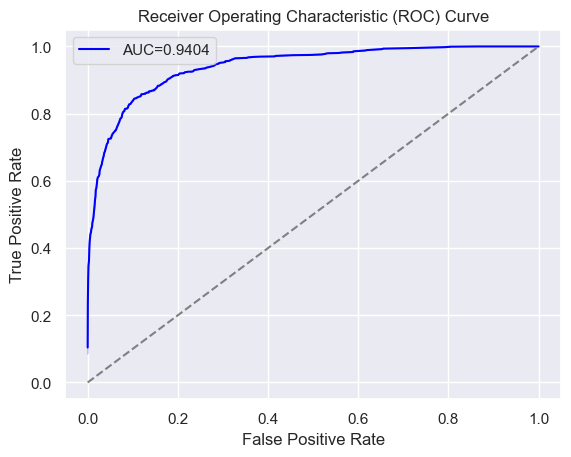
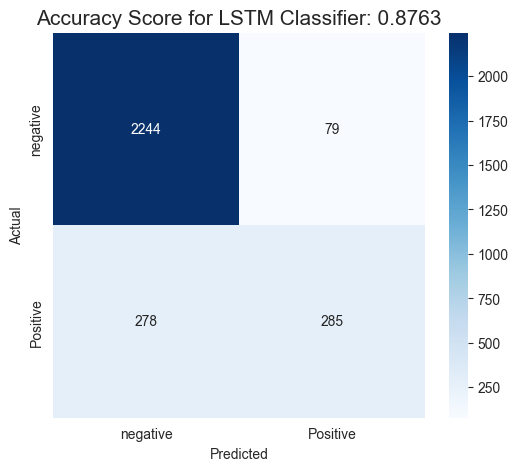
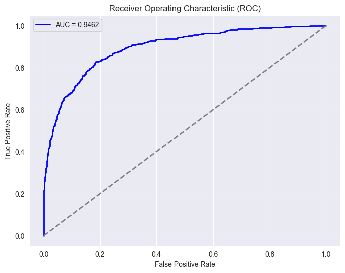
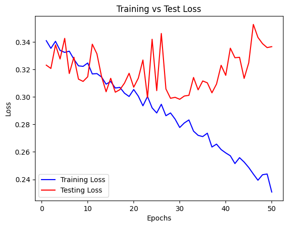
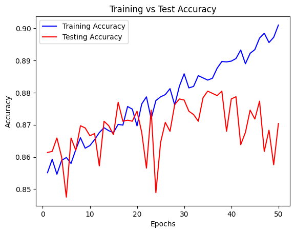
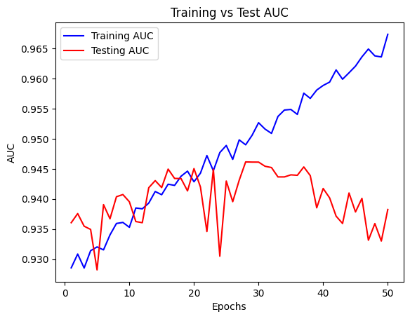

# Sentiment Analysis of US Airline Tweets

## Introduction
This project focuses on sentiment analysis of tweets related to US airlines. The dataset used for this analysis is the [Twitter US Airline Sentiment dataset](https://www.kaggle.com/datasets/crowdflower/twitter-airline-sentiment) from Kaggle. The goal is to classify tweets as either positive or negative sentiment.

[View Notebook](https://github.com/JacobJ215/Airline-Sentiment-Analysis/blob/main/notebooks/sentiment_analysis.ipynb)

## Libraries Used
The project utilizes various Python libraries including:
- Pandas
- NumPy
- Matplotlib
- Seaborn
- Scikit-learn
- TensorFlow
- NLTK
- Gensim

## EDA and Preprocessing
Exploratory Data Analysis (EDA) is conducted to understand the dataset. This involves checking for null values, obtaining descriptive statistics, and visualizing the distribution of sentiments. Text preprocessing techniques such as removing special characters, tokenizing, removing stopwords, and lemmatization are applied.

#### Distribution of Sentiment

As we can see from the chart there is a much greater frequency of negative reviews comparred to postive reviews.

#### Distribution of Review Lengths by Sentiment

According to this histogram the curve for the Negative review class is skewed to the left where the majority of negative reviews tend to be in the longer range at 80-100 words in length. The postive review class is practically uniformaly distrubuted where the length of each positive review has the same probability of being submitted.

#### Word Cloud of most frequent words

## Classical ML Approach
### Data Preparation
The text data is vectorized using TF-IDF vectorization. The dataset is split into training and testing sets.

### Random Forest and XGBoost
A Random Forest Classifier and an XGBoostClassifier are trained and evaluated for sentiment classification. Hyperparameter tuning is performed using GridSearchCV for the XGBoost model.

### Evaluation and Results
The models are evaluated using metrics such as accuracy, ROC curve, and confusion matrix. Visualizations are generated to illustrate model performance.

**Base Model Performance**
* Accuracy - Random Forest: 90.18%
* Accuracy - XGBoostClassifier: 90.33%

**Optimized XGBoost Performance and Evaluation**
* Accuracy - XGBoostClassifier: 90.50% (not much improvement)
* AUC - XGBoostClassifier: 0.9404

**Confusion Matrix**

**ROC AUC Curve**

### XGBoost Model Predictions

#### Positive Texts

- "co flight great http jetblue view"
- "ago airport busiest club month none one thank united weird"
- "americanair followed great thanks"
- "got thanks united"
- "a320 airbus bostonlogan co gate http jetblue jetbluesofly morning pulling sunrise"

#### Negative Texts

- "cancelled charged flight flightled unbelievable usairways"
- "actually agent awful booking flight gate line missed problem reflight rude standing sti united waiting"
- "200 aa additional americanair asleep back called everything fee flightr gr8 hr late standard took worry"
- "2015 airline brother country cross cup flight help lost luggage panamerican please sunday united"
- "flow hard keeping making positive smoothly sure thing usairways work"

## Deep Learning Approach
### Tokenization and Embedding
The text data is tokenized and sequences are created. Word embeddings using Word2Vec are performed.

Tokenization is a crucial step in natural language processing (NLP) tasks. It involves breaking down text into individual words or tokens. These tokens serve as the basic units of analysis for the subsequent steps in the NLP pipeline.

Once tokenized, these individual words need to be converted into a format suitable for input into a neural network. This is where embeddings come into play. Embeddings are vector representations of words that capture semantic relationships. In other words, they represent words in a continuous vector space, where similar words are located closer to each other.

One popular technique for generating word embeddings is Word2Vec. Word2Vec is a shallow neural network model trained to reconstruct linguistic contexts of words. It learns to map words to a high-dimensional vector space in such a way that words with similar contexts are closer to each other in the vector space.

Word2Vec can be thought of as a form of unsupervised learning for NLP. It learns to predict the probability of a word occurring in a context given the current word. This is done through two types of models: Continuous Bag of Words (CBOW) and Skip-gram. CBOW predicts the current word based on its context, while Skip-gram predicts the context based on the current word.

In our project, Word2Vec is employed to generate word embeddings for the tweets. These embeddings capture the semantic relationships between words in the dataset. This enables the LSTM model to understand the contextual meaning of words in the tweets, which is crucial for accurate sentiment analysis.

The embeddings are then used as the initial layer in our LSTM model. During training, the weights of this embedding layer are fine-tuned along with the rest of the network to optimize performance on the sentiment classification task. This allows the model to adapt the embeddings to the specific characteristics of the dataset and the sentiment analysis task at hand.

### LSTM Model
A deep learning model is defined with embedding layers and LSTM units for sentiment analysis. The model is compiled and one-hot encoding is applied to the labels.

### Model Training
The LSTM model is trained and evaluated. Loss, accuracy, and AUC metrics are plotted across epochs. A ModelCheckpoint callback is used to save the best model.

### Evaluation and Results
The best model is loaded and evaluated on the test set. Predictions are made, and positive/negative texts are identified based on these predictions.

**Model Performance**
* Accuracy - Best LSTM: 87.63%
* AUC - Best LSTM: 0.9462

**Confusion Matrix**

**ROC AUC Curve**

**Loss and Metric Plots (50 epochs)**

**Training vs Testing Loss**

The training and testing losses begin to diverege around 20 or so epochs, this is where the model begins overfitting.

**Training vs Testing Accuracy**

Like with the loss the training and testing accuracies begin to diverege around 20 or so epochs, this is where the model begins overfitting.

**Training vs Testing AUC**

As with both the loss and the accuracy training and testing auc scores begin to diverege around 20 or so epochs, this is where the model begins overfitting. This is also where our checkpoint saves the best model - where the test auc performs the best. 

### LSTM Model Predictions

#### Positive Texts

- "jetblue great flight great view http co yxn00pnoav"
- "united thank one month ago none weird club one busiest airport u"
- "americanair great thanks followed"
- "united got thanks"
- "virginamerica look like broken link asset http co oardjjgrrd"

#### Negative Texts

- "usairways charged flight cancelled flightled unbelievable unheard"
- "united actually gate agent rude standing line waiting reflight booking problem missed flight sti awful"
- "americanair worry called back 4 hr late flightr asleep took additional 200 fee aa standard everything gr8"
- "united brother luggage lost copa airline flight 635 competing sunday 2015 panamerican cross country cup please help"
- "usairways work hard making sure thing flow smoothly keeping positive"

## Conclusion

In this sentiment analysis project, we set out to classify tweets related to US airlines as either positive or negative. Two approaches were explored: a classical machine learning approach using Random Forest and XGBoost, and a deep learning approach employing LSTM.

After extensive preprocessing and exploratory data analysis, both models were trained and evaluated. The classical machine learning models achieved impressive results with an accuracy of 90.50%. The XGBoost model was further fine-tuned through hyperparameter tuning, leading to a marginal improvement in accuracy.

The deep learning LSTM model, on the other hand, demonstrated its potential, achieving an AUC score of 0.9462, surpassing the optimized XGBoost's AUC of 0.9404. Despite the slight decrease in accuracy compared to the classical ML models, the LSTM's superior AUC score indicates its strength in distinguishing between positive and negative sentiments.

The choice of AUC as the final metric was deliberate. It is particularly useful in cases where class imbalance is present, as in our dataset where negative sentiments were more prevalent. AUC provides a more comprehensive evaluation of the model's performance across different thresholds, making it a reliable metric for imbalanced datasets.

Taking all factors into consideration, the LSTM model is ultimately chosen for its superior AUC score, indicating its efficacy in distinguishing between sentiments. The trade-off in accuracy is acceptable given the importance of correctly identifying negative sentiments in this context.

This project demonstrates the versatility of machine learning and deep learning techniques in sentiment analysis and underscores the significance of selecting appropriate evaluation metrics based on the specific characteristics of the dataset.